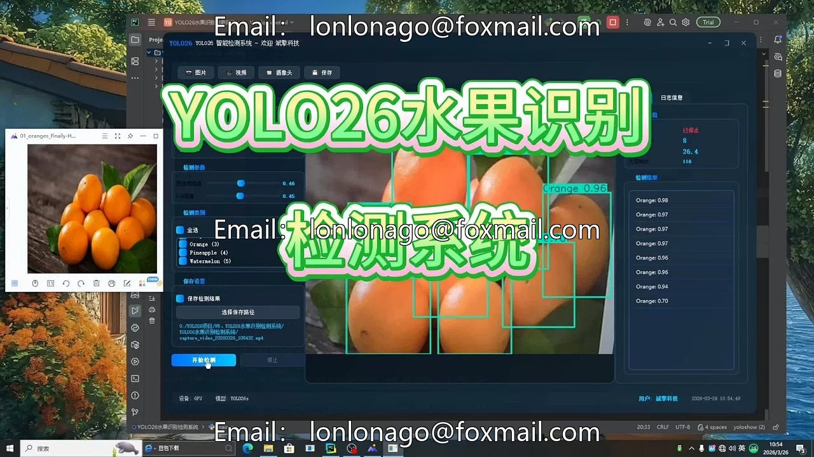
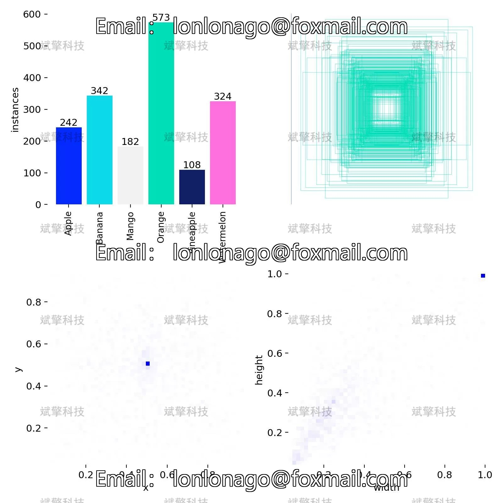
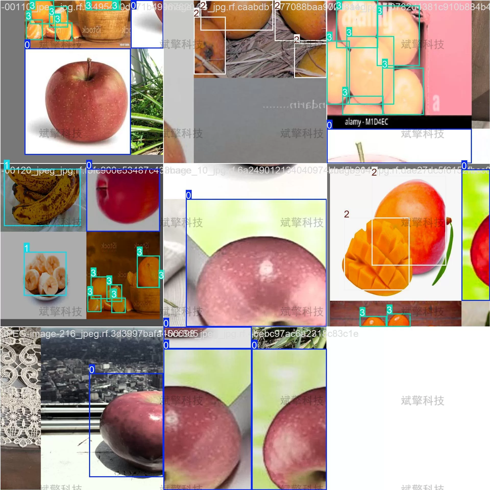
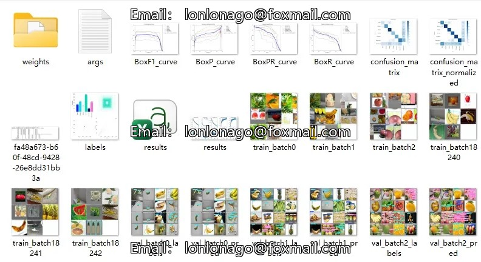
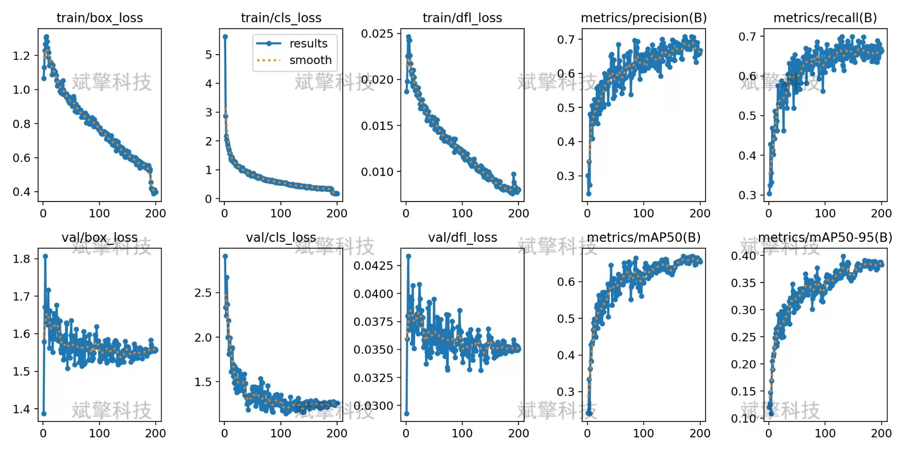
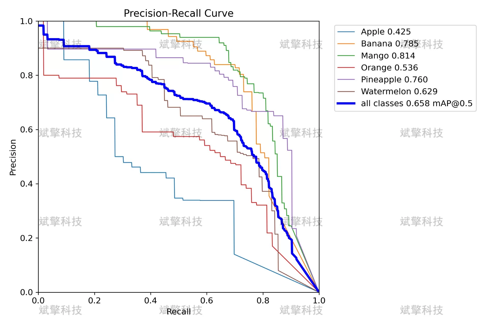
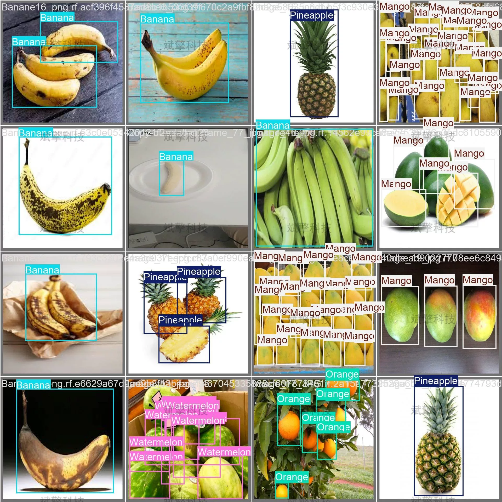
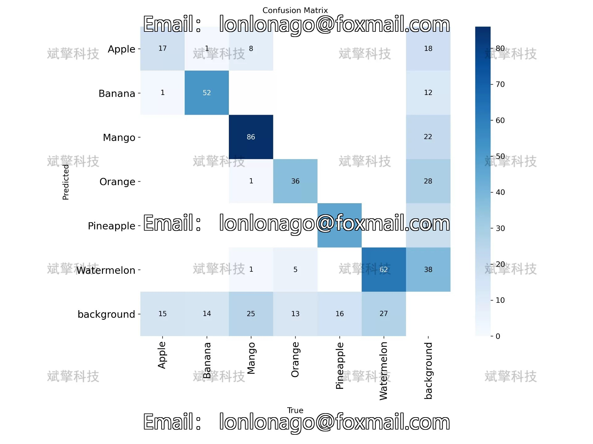
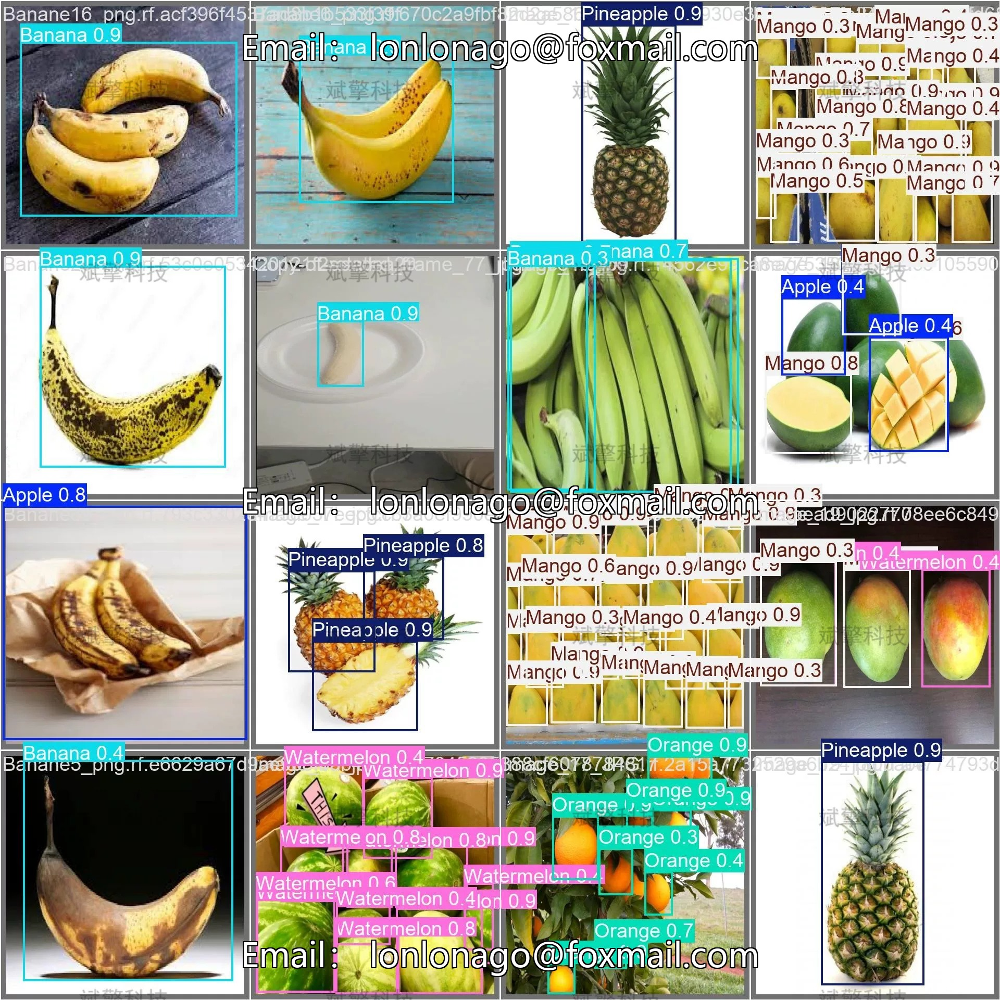

# YOLO Fruit Identification Detection System | Model + Dataset

## Body

YOLO Fruit Identification and Detection System | Model + Dataset Hands-On Tutorial on Deploying the YOLO26 Fruit Detector: From Training to Validation (including Apple/Banana/Mango/Orange/Pineapple/Watermelon)

This system is based on the YOLO26 object detection algorithm and has built a intelligent recognition and detection system for six common fruits (Apple, Banana, Mango, Orange, Pineapple, Watermelon). The system uses deep learning technology, through training and validation of fruit image data, realizes high accuracy real-time detection of various fruits. Experimental results show that the model achieves an overall average precision (mAP50) of 65.8% on the validation set, with the detection effect of Mango and Orange being the best, mAP50 reaching 78.5% and 81.4% respectively. While maintaining high detection accuracy, the system also has good real-time performance, with a single image inference time of only 1.7ms, meeting the needs of fruit recognition detection in practical application scenarios. This system can provide technical support for intelligent retail, agricultural product sorting, orchard monitoring, and other fields.

The dataset used in this study includes six common fruits, namely: Apple (Apple), Banana (Banana), Mango (Mango), Orange (Orange), Pineapple (Pineapple), Watermelon (Watermelon), with a total number of categories nc=6.

Dataset scale:
Training set: 768 images
Validation set: 129 images
Test set: 110 images

Free appointment for remote installation. Unsuccessful full refund.
Purchase enjoy the following resources (Baidu Drive automatically unlocked):
YOLO Recognition Detection Project complete source code
YOLO format dataset
Training code + UI interface code
Trained model + result images
Software install package
Add WeChat to make an appointment for remote installation (Automatically display WeChat ID after purchase) - Unsuccessful full refund

⚙️ Core function modules
Detection capability
Image detection: upload and detect, return detection box + category information
Video detection: supports video files, analyze each frame accurately
Camera real-time detection: connect USB camera, realize dynamic monitoring
Interaction and control
Target filtering: freely choose one or more categories for detection
Parameter real-time adjustment: adjustable confidence threshold & IoU threshold, flexible control accuracy
Result saving: save images/video/camera detection results in one click
System and data
User login registration: Support password strength detection + encryption storage
Log recording: automatically record operation and error information (with timestamp)

## Images

## Payment

Here is a pay link on Stripe ( https://buy.stripe.com/3cs8yP7sY87d0vu9AB ). Please contact me lonlonago@foxmail.com after funding $89, and I will send you a complete data files , thank you!

